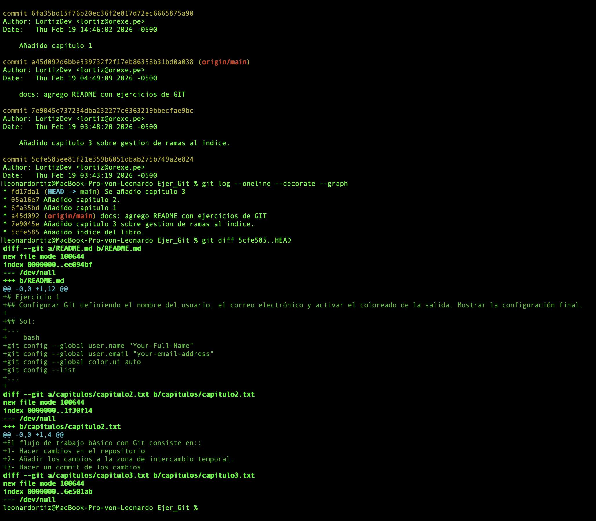
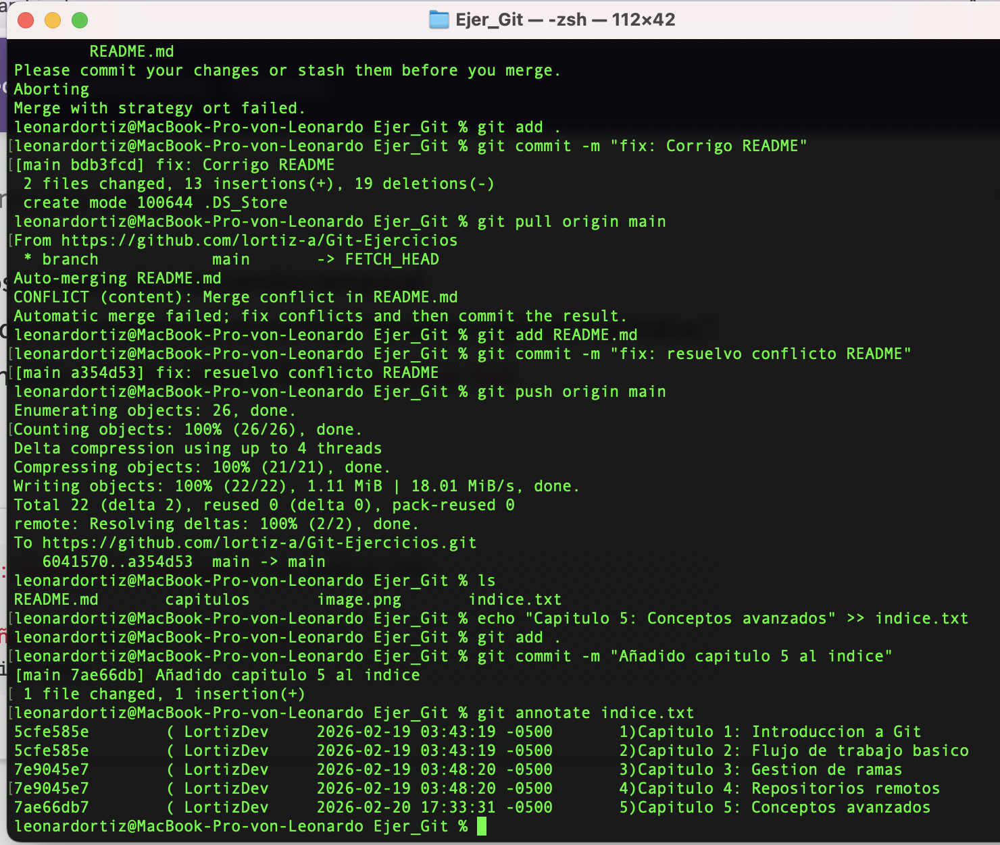

# Ejercicio 1
## Configurar Git definiendo el nombre del usuario, el correo electrónico y activar el coloreado de la salida. Mostrar la configuración final.

## Sol:
```bash
git config --global user.name "Your-Full-Name"
git config --global user.email "your-email-address"
git config --global color.ui auto
git config --list
```

# Ejercicio 3
### 1. Crear el fichero capitulo3.txt en la carpeta capitulos con el siguiente texto.
Git permite la creación de ramas lo que permite tener distintas versiones del mismo proyecto y trabajar de manera simultanea en ellas.

### 2. Añadir los cambios a la zona de intercambio temporal.
### 3. Hacer un commit de los cambios con el mensaje "Añadido capítulo 3."
### 4. Mostrar las diferencias entre la primera y la última versión del repositorio.
```bash
cat > capitulos/capitulo3.txt
git add .
git commit -m "Añadido capítulo 3."
git log
git diff <hash primera version>..HEAD
```



# Ejercicio 4
## 1. Añadir al final del fichero `indice.txt` la siguiente línea:
Capítulo 5: Conceptos avanzados
## 2. Añadir los cambios a la zona de intercambio temporal.
## 3. Hacer un commit de los cambios con el mensaje "Añadido capítulo 5 al índice."
## 4. Mostrar quién ha hecho cambios sobre el fichero `indice.txt`.

## Sol:
```bash
echo "Capítulo 5: Conceptos avanzados" >> indice.txt
git add .
git commit -m "Añadido capítulo 5 al índice."
git annotate indice.txt
```

